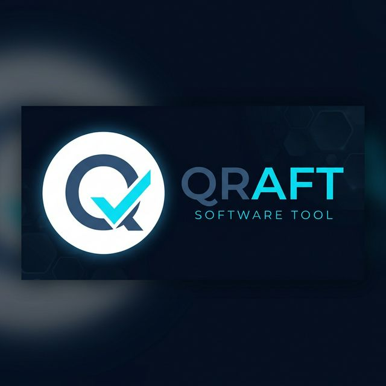
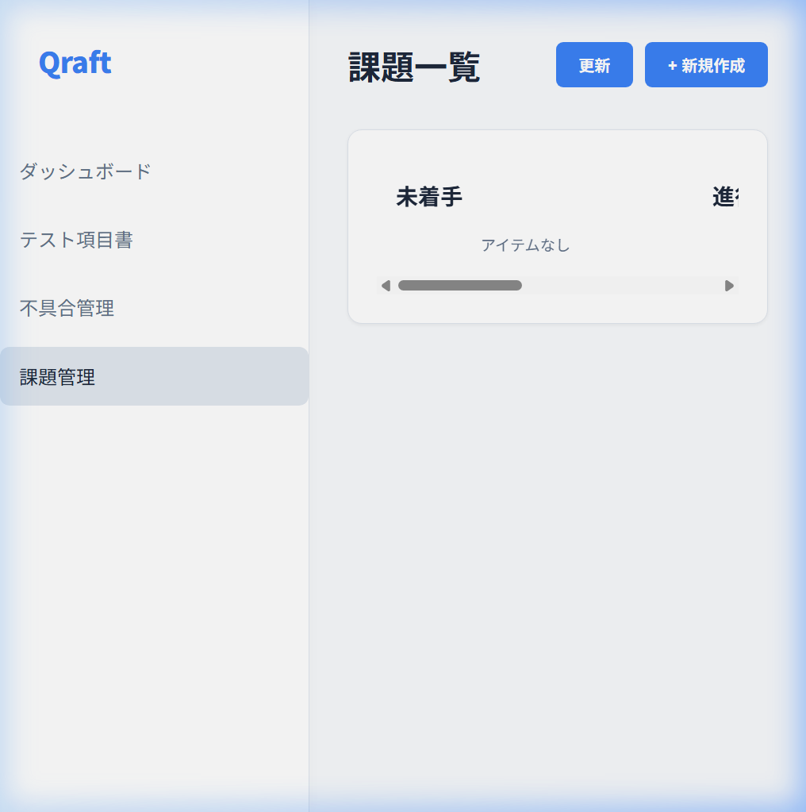
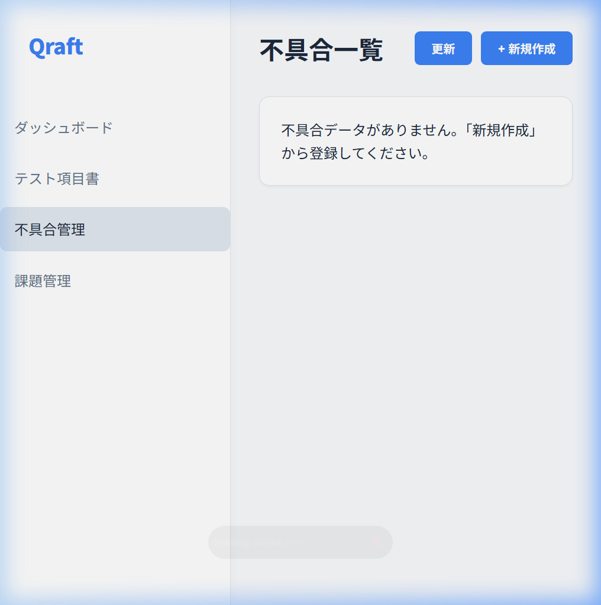

# Qraft (Quality Management Suite)

<p align="center">
  
</p>

<p align="center">
  <a href="https://github.com/junichi-muraoka/ut-qms/actions/workflows/ci.yml">
    
  </a>
  <a href="https://github.com/junichi-muraoka/ut-qms/actions/workflows/deploy.yml">
    
  </a>
  
  
</p>

---

Qraftは、ソフトウェア開発における「品質」を可視化し、一元管理するための品質管理スイートです。モダンな技術スタック（React 19 & Hono）を採用し、エッジ環境での超高速な応答性能を実現しています。

## 📚 ドキュメント (Documentation)

プロジェクトの全体像を把握するための詳細ドキュメントは以下の通りです。

- [**要件定義書 (Requirements)**](./docs/requirements.md): プロジェクトの目的、背景、機能一覧。
- [**機能仕様書 (Functional Specifications)**](./docs/functional_specifications.md): 画面遷移、UI/UX、バリデーションルール。
- [**アーキテクチャ設計 (Architecture)**](./docs/architecture.md): システム構成、ER図、技術選定理由。
- [**Cloudflare 構成概要**](./docs/cloudflare_overview.md): エッジ環境のインフラ詳細。
- [**開発ワークフロー**](./docs/development_workflow.md): Git運用、CI/CDプロセス。

## 📸 ビジュアル・ツアー (Visual Tour)

Qraft の直感的な管理インターフェースをご紹介します。

#### ダッシュボード
開発状況と品質指標をリアルタイムに可視化します。


#### 課題管理 (Issues Board)
プロジェクトのタスクをステータスごとに整理・管理します。


#### テスト項目書 (Test Cases)
テストシナリオの設計と実行結果を記録します。


#### 不具合管理 (Defects)
検出されたバグの追跡と修正状況を管理します。


## ✨ 注目機能 (Key Features)

- **📈 品質の可視化**: テスト通過率や欠陥密度を Recharts で美しくグラフ化。
- **🛡️ クオリティ・ゲート**: CI/CD と連携し、低品質なコードのマージを自動でブロック。
- **☁️ エッジ・ネイティブ**: Cloudflare Workers / Pages 上で動作する次世代の管理ツール。
- **📦 モノレポ構成**: フロント・バック・共有型を一つのリポジトリで一元管理。

## 🛠 テクノロジー (Tech Stack)

### フロントエンド
- **React 19**: 最新機能（React Compiler等）を活用した高効率なUI開発。
- **Vite & Recharts**: 高速なビルドと洗練されたデータビジュアライゼーション。
- **Vitest**: 信頼性を担保する高速なテストランナー。

### バックエンド
- **Hono**: サーバーレス環境に特化した、超軽量かつ拡張性の高いフレームワーク。
- **Drizzle ORM & Cloudflare D1**: 型安全な操作とエッジでの永続化。
- **Zod**: バックエンドからフロントエンドまで貫通する堅牢なバリデーション。

## 📂 プロジェクト構成

```text
.
├── client/          # フロントエンド (React / Vite)
├── server/          # バックエンド (Hono / Workers)
├── shared/          # 共有型定義・バリデーション (TypeScript / Zod)
├── e2e/             # E2Eテスト (Playwright)
├── docs/            # 日本語ドキュメント・環境定義
└── scripts/         # 開発・運用向けユーティリティ
```

## 📋 クイックスタート

### 1. セットアップ
リポジトリをクローン後、依存関係をインストールします。
```bash
npm install
```

### 2. 開発用サーバーの起動
フロントとバックを個別に起動できます。

| 対象 | コマンド | 詳細 |
| :--- | :--- | :--- |
| **Backend** | `npm run server` | Port 3001 で API を起動 |
| **Frontend** | `npm run client` | Vite デブサーバーを起動 |

## 🌐 実行環境

GitHub Actions により、各環境へ自動デプロイされます。

| 環境 | ターゲット | ブランチ | アクセスURL |
| :--- | :--- | :--- | :--- |
| **Production** | `qraft` | `main` | GitHub Release 公開時に実行 | [🔗 ut-qms.pages.dev](https://ut-qms.pages.dev) |
| **Staging** | `qraft` | `develop` | プッシュ時に自動デプロイ | [🔗 develop.ut-qms.pages.dev](https://develop.ut-qms.pages.dev) |

詳細は [実行環境（詳細）](./docs/environments.md) をご覧ください。

## 🏹 開発ワークフロー

1. **Issue の選定**: 担当タスクを GitHub Issues から選択。
2. **ブランチ作成**: `feature/...` または `fix/...` を作成。
3. **テスト実装**: `npm run test` が通ることを確認。
4. **プルリクエスト**: GitHub Actions のチェックをパスしてマージ。

詳細は [開発ワークフローガイド](./docs/development_workflow.md) を参照してください。

---
<p align="center">
  Maintained by <b><a href="https://github.com/junichi-muraoka">junichi-muraoka</a></b>
</p>
