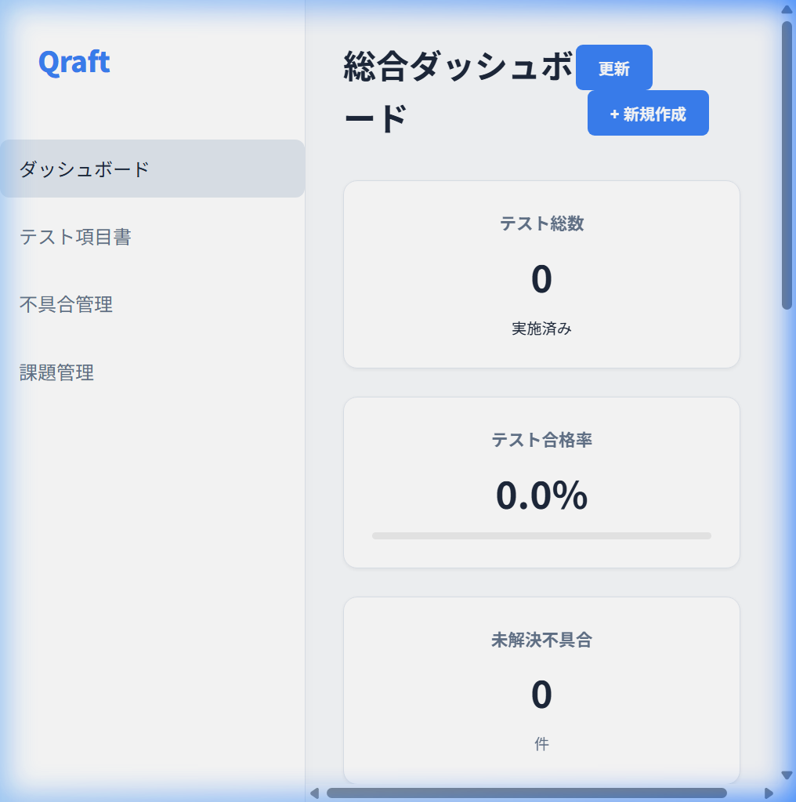
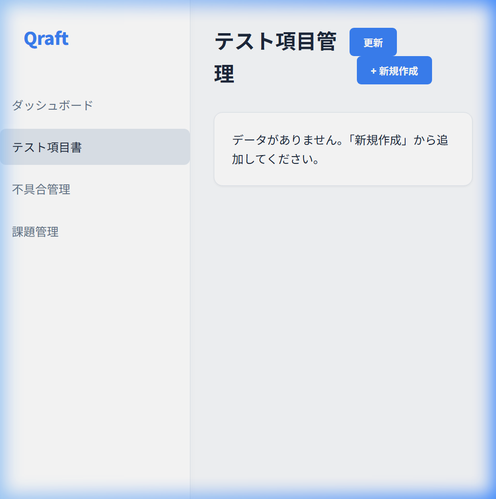
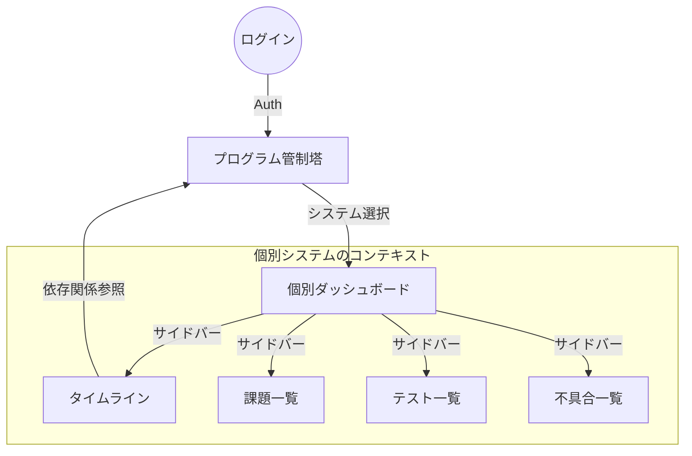
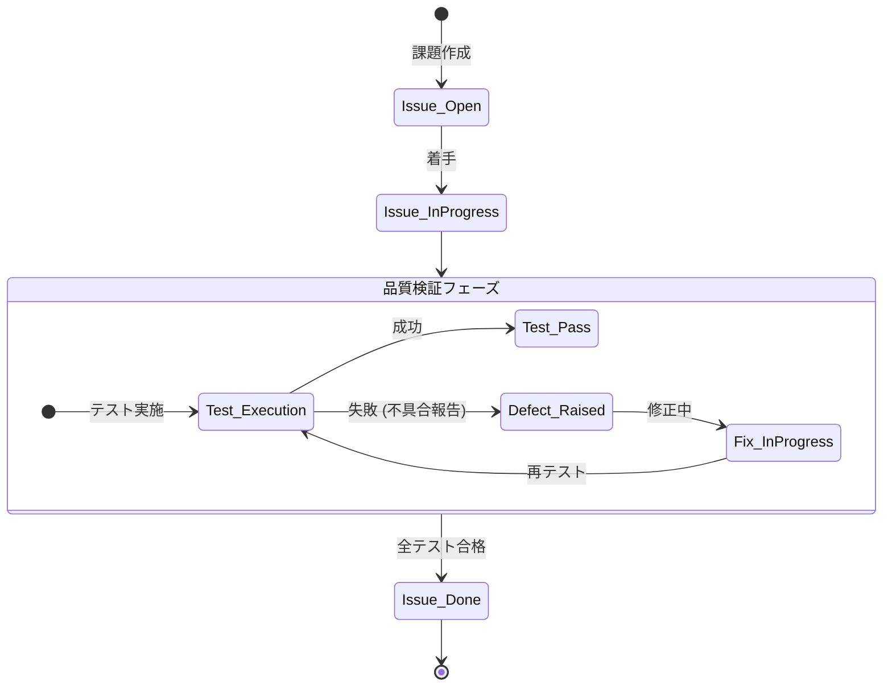

# 機能仕様書 (Functional Specifications)

Qraft は、フロントエンドからバックエンドまで一貫した品質管理環境を提供します。本ドキュメントでは、各画面の機能、API、およびデータ連携のフローを定義します。

## 1. 画面構成・UI ガイド

### 1.0 プログラム管制塔 (Program Tower) - NEW
複数システムの状況を横断的に監視・管理するための最上位ダッシュボードです。

- **システム一覧**: 各システムごとの「進捗」「不具合密度」「最終判定（Verdict）」、および「納期遅延リスク」を表示。
- **PMO フィルタ**: 管理対象の特定システムのみを絞り込み表示。

### 1.1 ダッシュボード (Standard Dashboard)
プロジェクト全体の健康状態を一目で把握するためのポータルです。

- **主要な指標**: Total Progress, Test Pass Rate, Open Defects.
- **可視化**: Recharts によるトレンド分析グラフ。

### 1.2 課題ボード (Task Board)
カンバン形式によるタスク管理を提供。

- **アクション**: ドラッグ＆ドロップによるステータス変更。

### 1.3 テスト管理 (Test Cases)
品質検証の最小単位を管理。

- **実行結果**: Pass, Fail, NoRun, Blocked の 4 ステート。

---

---

## 3. 統合ライフサイクル (Integrated Lifecycle)
課題・テスト・不具合がどのように連携して品質を担保するかを示します。

---

## 4. API 仕様 (High-Level Mapping)

Hono で実装されたバックエンドが提供する主要なエンドポイントです。

| カテゴリ | エンドポイント | メソッド | 説明 |
| :--- | :--- | :--- | :--- |
| **Test** | `/api/test-items` | GET / POST | テスト項目の一覧取得・作成 |
| **Defect** | `/api/defects` | GET / POST | 不具合の一覧取得・作成 |
| **Issue** | `/api/issues` | GET / POST | 課題の一覧取得・作成 |
| **Stats** | `/api/stats` | GET | ダッシュボード用統計データ |

---
## 🔗 関連ドキュメント
- [要件定義書 (Requirements)](./requirements.md)
- [アーキテクチャ設計 (Architecture)](../02_architecture/architecture.md)
- [ドキュメント一覧に戻る](../README.md)
