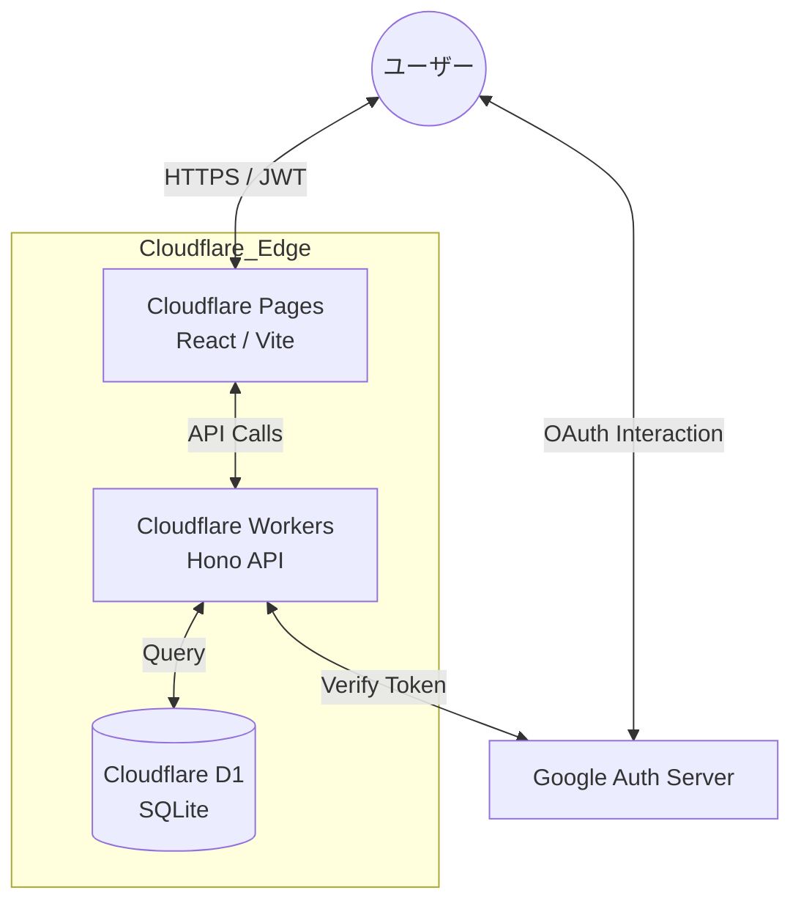
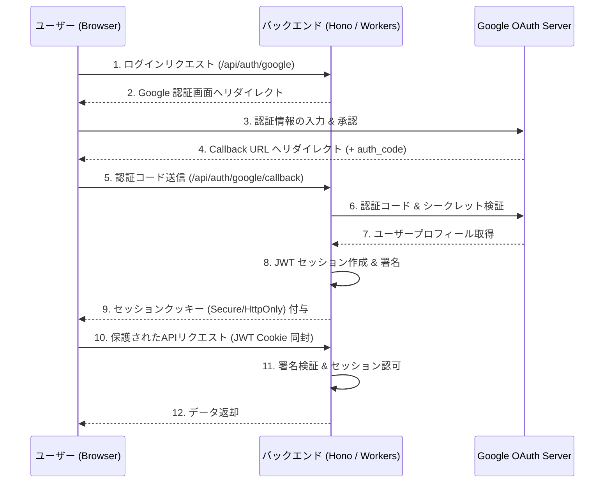
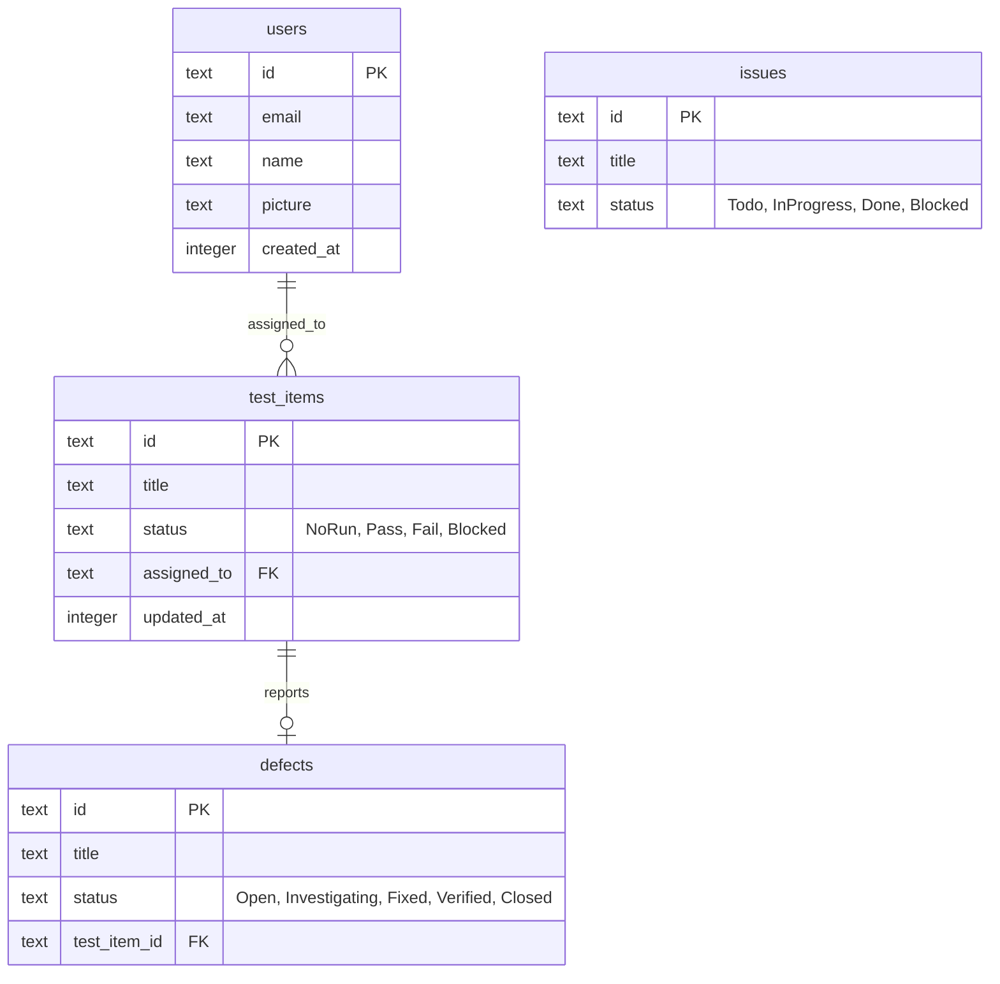

# アーキテクチャ設計 (Architecture Design)

## 1. システム全体構成
Qraft は Cloudflare プラットフォームに最適化されたエッジネイティブ・アプリケーションです。

## 2. 認証・セッション管理 (Authentication Flow)
認証プロバイダ (Google) とバックエンド (Hono/Workers) 間の詳細なやり取りです。

- **ミドルウェア**: Hono バックエンドにカスタム認証ミドルウェアを配備し、すべての保護されたリクエストをエッジで検証。

## 3. データモデル (ER図)
Drizzle ORM で定義されているコア・エンティティのリレーションシップです。

## 4. 技術スタックの選定理由
- **Frontend (React 19 + Vite)**: 最新の React 機能を活用し、高速な HMR とビルドを実現。
- **Backend (Hono)**: Cloudflare Workers での動作に特化した、極めてオーバーヘッドの少ない TypeScript 特化型フレームワーク。
- **ORM (Drizzle)**: 型安全なクエリと、D1 (SQLite) とのシームレスな統合。
- **Security (Jose)**: エッジ環境で高速に JWT の署名・検証を行うための軽量ライブラリ。