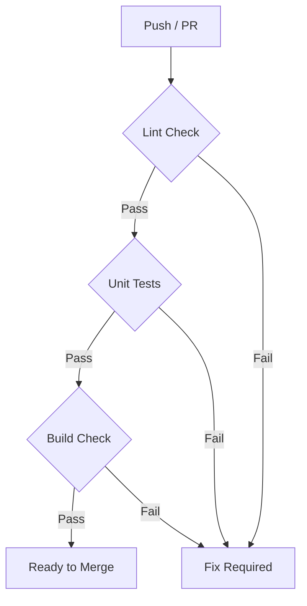

# テスト仕様・戦略 (Testing Strategy & Specification)

Qraft の品質を担保するために、多層的なテストアプローチ（単体テスト、E2Eテスト、手動テスト）を採用しています。

## 1. テストの目的
- **早期発見**: コードの変更による意図しない不具合（回帰バグ）の防止。
- **仕様の明文化**: テストコードそのものを、期待される動作のドキュメントとして機能させる。
- **トレーサビリティ**: テストが失敗した際に、どの機能に問題があるかを即座に特定する。

---

## 2. テストの層とツール

### 2.1 単体テスト (Unit Testing)
- **対象**: 各関数、バリデーションロジック、ユーティリティ、バックエンド API (Hono)。
- **ツール**: [Vitest](https://vitest.dev/)
- **場所**: 各コンポーネントと同ディレクトリ（例: `server/index.test.ts`）
- **コマンド**: `npm run test`

### 2.2 E2E テスト (End-to-End Testing)
- **対象**: ユーザー体験（ログイン、課題作成、ボード操作、グラフ表示など）。
- **ツール**: [Playwright](https://playwright.dev/)
- **場所**: `e2e/` ディレクトリ
- **目的**: フロントエンドとバックエンドの連携が正しく機能しているかを確認。

### 2.3 手動テスト (Manual Testing)
- **対象**: 自動化が困難な UI の微調整、ユーザー体験の心地よさ、新規プロトタイプ。
- **ツール**: **Qraft 自体を使用**
- **運用**: 開発者は `docs/testing_strategy.md` に基づき、新規機能リリース前にセルフチェックを行う。

---

## 3. テスト項目例（合格基準）

### 3.1 課題管理 (Issue Tracking)
- [ ] タイトルを入力した際、正常にカードがボードに追加されること。
- [ ] ドラッグ＆ドロップでステータスを変更した際、再読み込み後も状態が維持されること。

### 3.2 テスト・不具合連携
- [ ] テスト結果を `Fail` に変更した際、不具合起票用のポップアップ/リンクが表示されること。
- [ ] 不具合を `Fixed` にした際、関連するテストケースが通知されること。

### 3.3 ダッシュボード
- [ ] データが存在しない場合でも、グラフがクラッシュせずに「No Data」のメッセージが表示されること。
- [ ] 統計数値がバックエンドの生データと一致していること。

---

## 4. 品質ゲート (Quality Gate)

GitHub Actions を通じて、以下のチェックがマージ前に自動で走ります。

> [!TIP]
> テストコードの実装に迷った際は、`server/index.test.ts` の既存のモック実装を参考にしてください。
