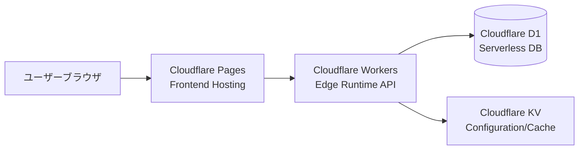
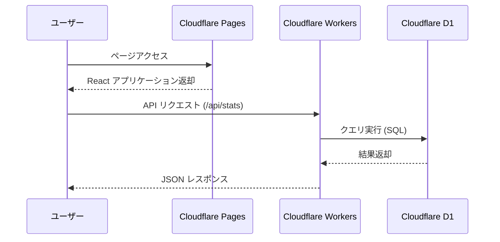

# Cloudflare 構成概要 (Infrastructure Overview)

Qraft は、Cloudflare の提供するサーバーレスプラットフォームをフル活用することで、ゼロ・インフラ管理と高いスケーラビリティを両立しています。

## 1. コンポーネント構成

## 2. 各サービスの詳細

### Cloudflare Pages
- **役割**: 静的アセット（HTML, JS, CSS）のホスティング。
- **機能**: Web Analytics による利用状況の可視化、プレビューデプロイ機能。

### Cloudflare Workers (Hono)
- **役割**: バックエンド API ロジックの実行。
- **利点**: 世界中に配置されたエッジで動作するため、レイテンシが極めて低い（Cold start がほぼゼロ）。

### Cloudflare D1
- **役割**: リレーショナルデータベース (SQLite)。
- **特徴**: 型安全な Drizzle ORM と組み合わせることで、堅牢なデータ永続化を実現。

---

### 🔑 認証基盤 (Cloudflare Zero Trust)
Qraft は、安全なシングルサインオン (SSO) を実現するために Cloudflare Zero Trust を採用しています。詳細なメリットや設定については、以下のドキュメントを参照してください。

- [**Cloudflare Zero Trust / SSO 導入ガイド**](./cloudflare_zero_trust.md)

## 3. インフラ・ダイヤグラム

> [!NOTE]
> プロジェクトのデプロイ設定は `.wrangler/` および `wrangler.toml` で管理されています。
