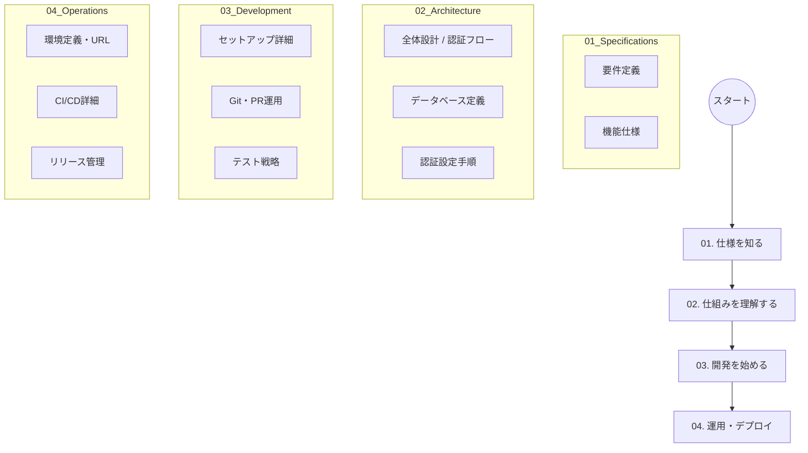

# Qraft ドキュメント・インデックス (Documentation Index)

Qraft プロジェクトの全ドキュメントを体系的に整理しています。開発や運用の目的に合わせて、以下のマップを参照してください。

## 🗺 ドキュメント・マップ

---

## 🔎 各カテゴリの詳細

### [01. Specifications (仕様)](./01_specifications/)
プロジェクトの「なぜ」と「何」を定義しています。
- [要件定義書 (Requirements)](./01_specifications/requirements.md)
- [機能仕様書 (Functional Specifications)](./01_specifications/functional_specifications.md)

### [02. Architecture (アーキテクチャ)](./02_architecture/)
システムが「どう動いているか」を解説しています。
- [アーキテクチャ設計 (Architecture)](./02_architecture/architecture.md)
- [データベース定義 (Database Schema)](./02_architecture/database_schema.md)
- [Google OAuth 設定ガイド](./02_architecture/google_auth_setup_guide.md)

### [03. Development (開発)](./03_development/)
開発者として「どう参加するか」をガイドしています。
- [開発セットアップ](./03_development/setup_deployment.md)
- [開発ワークフロー](./03_development/development_workflow.md)
- [テスト・品質管理戦略](./03_development/testing_strategy.md)

### [04. Operations (共有・運用)](./04_operations/)
デプロイ先や「どう安定稼働させるか」をまとめています。
- [実行環境定義](./04_operations/environments.md)
- [CI/CD パイプライン詳細](./04_operations/cicd_setup.md)
- [リリース管理ガイド](./04_operations/release_management_guide.md)

---

## 📦 アーカイブ (Archive)
過去の構成や非推奨となったドキュメントは [05_archive/](./05_archive/) に保管されています。
- [Cloudflare Zero Trust (SSO) 設定](./05_archive/cloudflare_zero_trust.md)
