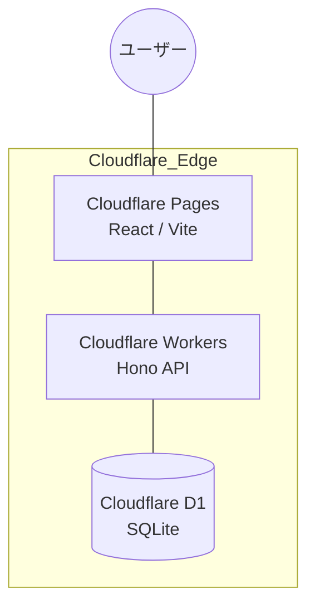
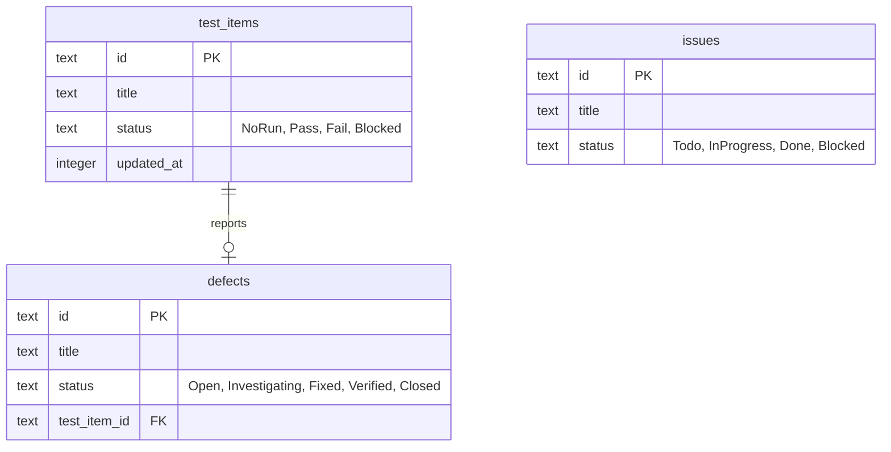

# アーキテクチャ設計 (Architecture Design)

## 1. システム全体構成
Qraft は Cloudflare プラットフォームに最適化されたエッジネイティブ・アプリケーションです。

## 2. データモデル (ER図)
Drizzle ORM で定義されているコア・エンティティのリレーションシップです。

## 3. 技術スタックの選定理由
- **Frontend (React 19 + Vite)**: 最新の React 機能を活用し、高速な HMR とビルドを実現。
- **Backend (Hono)**: Cloudflare Workers での動作に特化した、極めてオーバーヘッドの少ない API フレームワーク。
- **ORM (Drizzle)**: 型安全なクエリと、D1 (SQLite) とのシームレスな統合。
- **Styling (Vanilla CSS)**: 柔軟性とパフォーマンスを両立。
