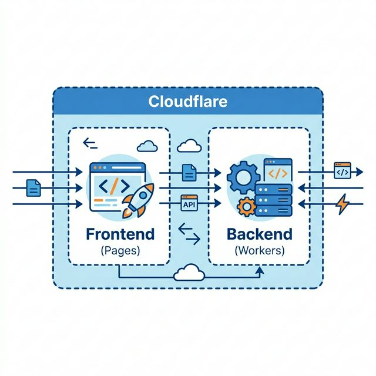

# インフラ構成：Cloudflare 採用の背景と役割

本プロジェクト（Qraft）では、高速かつセキュアな実行環境を低コストで実現するため、Cloudflare のエッジコンピューティング技術を全面的に採用しています。

## 1. Cloudflare 採用の 3 つのメリット

### ⚡️ エッジでの高速処理 (Performance)
従来のサーバーとは異なり、世界中に分散された「エッジ」でプログラム（Hono / Workers）を実行します。ユーザーに最も近い場所からレスポンスを返すため、地理的な遅延（レイテンシ）を最小限に抑えられます。

### 🛡️ 多層的なセキュリティ (Security)
WAF（Web Application Firewall）や DDoS 保護が標準で組み込まれています。悪意のあるトラフィックをインフラ層で遮断し、アプリケーションの安全を自動的に守ります。

### 🚀 シームレスなデプロイ (Developer Experience)
GitHub との強力な連携により、コードをプッシュするだけでフロントエンド（Pages）とバックエンド（Workers）を即座に更新できます。今回のプラットフォーム選定において最も重視したポイントです。

## 2. コストパフォーマンスと信頼性

> [!TIP]
> **なぜ無料で運用できるのか？**
> Cloudflare には非常に寛容な「Free Plan」が用意されています。これはリソースの上限（リクエスト数など）に達すると課金されるのではなく、動作が一時停止する仕組みのため、意図しない高額請求のリスクがありません。

### 採用技術との親和性
バックエンドに使用している **Hono** は、Cloudflare Workers の性能を最大限に引き出すために設計されたフレームワークです。この組み合わせにより、サーバーレス環境でありながら非常に高い応答性能を実現しています。

## 3. インフラ構造の要約

| 機能 | 採用サービス | 主な役割 |
| :--- | :--- | :--- |
| **ホスティング** | Cloudflare Pages | React アプリ（フロントエンド）の配信 |
| **サーバーレス** | Cloudflare Workers | Hono による API（バックエンド）の実行 |
| **データベース** | Cloudflare D1 | エッジネイティブな SQLite データベース |

---
詳細な環境設定については [実行環境（詳細）](./environments.md) を参照してください。
