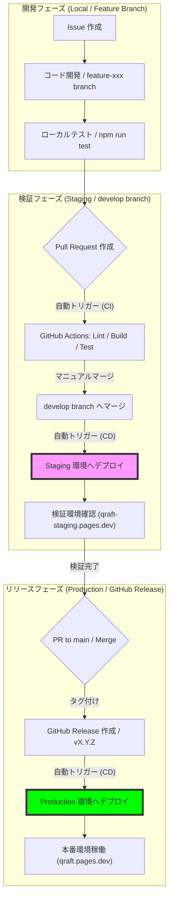

# デプロイ・フローと自動化の可視化

Qraft の開発から本番リリースまでのライフサイクルと、各ステップのトリガー（自動/手動）を整理しました。

## 1. エンドツーエンド・フロー図

---

## 2. 自動化レベルとトリガー詳細

| ステップ | 実行内容 | トリガー | 自動化レベル |
| :--- | :--- | :--- | :--- |
| **CI チェック** | Lint, 型チェック, 単体テスト | PR 作成 / 更新 | **完全自動** |
| **Staging デプロイ** | Cloudflare Pages / Workers (Stage) | `develop` ブランチへのマージ | **完全自動** |
| **Production デプロイ** | Cloudflare Pages / Workers (Prod) | `main` ブランチへのマージ | **完全自動** |
| **PR レビュー** | コード品質、仕様確認 | 人による操作 | 手動 |
| **Staging 検証** | 動作確認、最終チェック | 人による操作 | 手動 |

---

## 3. 環境別の定義

### Staging (検証環境)
- **Branch**: `develop`
- **Frontend**: `qraft-staging.pages.dev`
- **Backend**: `qraft-staging` (Workers)
- **Database**: `qraft-db-staging` (D1)

### Production (本番環境)
- **Branch**: `main`
- **Frontend**: `qraft.pages.dev`
- **Backend**: `qraft` (Workers)
- **Database**: `qraft-db` (D1)

> [!TIP]
> 開発者は `feature/*` ブランチで作業し、まずは `develop` へマージしてステージング環境で動作を確認することが推奨されます。
