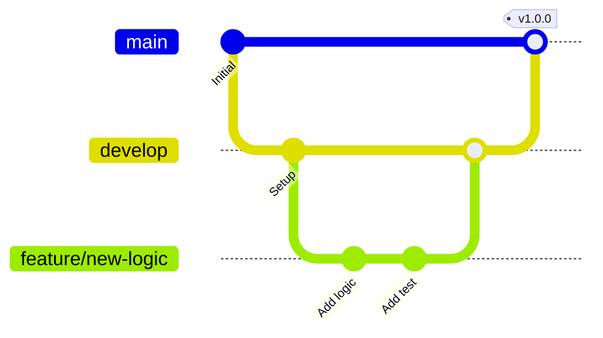
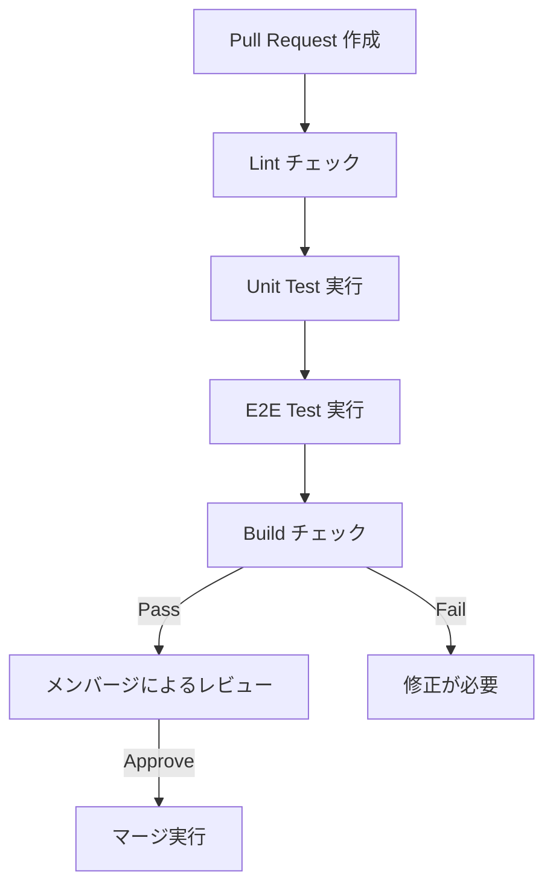

# 開発ワークフロー (Development Workflow)

本プロジェクトでは、品質を維持しながら高速に開発を進めるために、GitHub Actions を中心とした CICD ワークフローを定義しています。

## 1. GitHub Flow の採用

## 2. 開発ステップ

1. **Issue の選定**: 
   - 担当する課題（Issue）をアサインします。
2. **ブランチの作成**:
   - `develop` から `feature/description` または `fix/description` ブランチを切ります。
3. **ローカル開発**:
   - `npm run client` および `npm run server` で動作を確認。
4. **テストの実行**:
   - `npm run test` を実行し、回帰テストがパスすることを確認。
5. **プルリクの作成**:
   - GitHub 上で `develop` への PR を作成。

## 3. クオリティ・ゲート (Quality Gate)

PR が作成されると、以下のチェックが自動実行されます。

## 4. デプロイ構成

- **Staging**: `develop` ブランチが更新されると、`qraft-staging.pages.dev` に自動デプロイ。
- **Production**: `main` ブランチが更新（マージ）されると、`qraft.pages.dev` に自動デプロイ。
