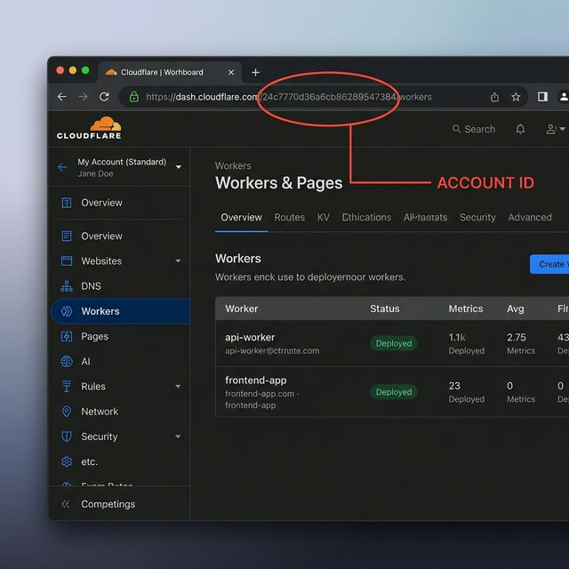
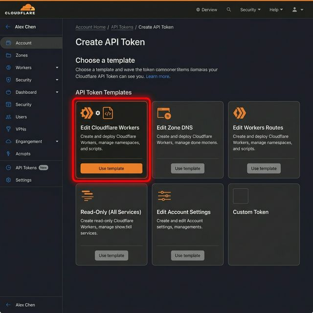
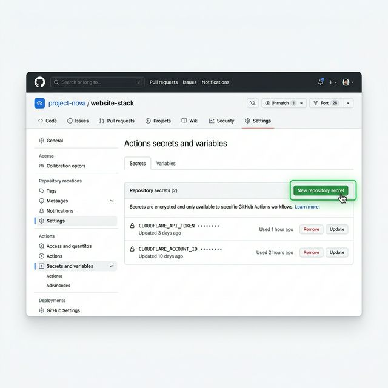

# デプロイ初期設定ガイド (Setup Deployment)

本ドキュメントでは、GitHub Actions を使用して Qraft を Cloudflare に自動デプロイするための初期設定手順を解説します。

> [!IMPORTANT]
> この設定はリポジトリの管理者、またはデプロイ権限を持つ担当者が一度だけ行う必要があります。

## 1. Cloudflare アカウント ID の確認
デプロイ先を特定するためのアカウント ID を取得します。

1. [Cloudflare ダッシュボード](https://dash.cloudflare.com/)にログインします。
2. ブラウザの URL を確認し、`dash.cloudflare.com/` の直後にある **32文字の英数字** をコピーしてください。これがあなたのアカウント ID です。

## 2. API トークンの発行
GitHub が Cloudflare のリソースにアクセスするための「鍵」を発行します。

1. 右上のアイコンから **[My Profile]** > **[API Tokens]** を開きます。
2. **[Create Token]** をクリックし、**[Edit Cloudflare Workers]** テンプレートを選択します。
3. そのまま **[Continue to summary]** > **[Create Token]** と進み、表示されたトークンを安全な場所にコピーします。
    - > [!WARNING]
      > トークンは一度しか表示されません。必ず確実にメモしてください。

## 3. GitHub Secrets への登録
取得した ID とトークンを GitHub のシークレットとして登録します。これにより、認証情報を漏洩させることなく安全に自動デプロイが可能になります。

1. GitHub リポジトリの **[Settings]** > **[Secrets and variables]** > **[Actions]** を開きます。
2. **[New repository secret]** から以下の 2 つを登録します。

| Secret 名 | 値 |
| :--- | :--- |
| `CLOUDFLARE_API_TOKEN` | 手順 2 で発行した API トークン |
| `CLOUDFLARE_ACCOUNT_ID` | 手順 1 で確認したアカウント ID |

## 4. 自動デプロイの確認
設定完了後、`main` ブランチへプッシュを行うと自動的にワークフローが開始されます。

> [!TIP]
> デプロイの進捗やエラーログは、GitHub の **[Actions]** タブからリアルタイムで確認できます。

---
詳細は [実行環境（詳細）](./environments.md) を参照してください。
